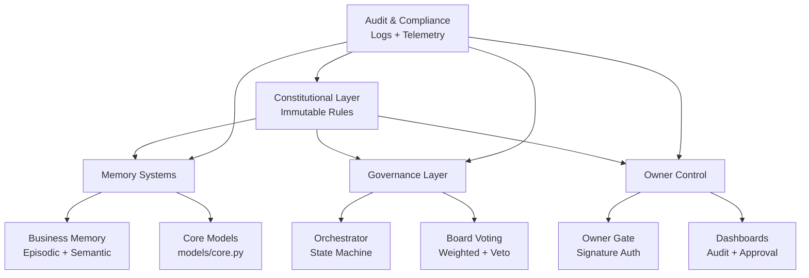

# Architecture Overview

The AI Business Governance Platform enforces a ten-rule constitution across every automated decision. The system orchestrates proposals through a fully logged, owner-controlled workflow that prioritizes financial outcomes, legal compliance, and transparent auditing.

## System Architecture

## Architectural Layers

- **Constitutional Layer (Immutable)**  
  `constitutional_layer_immutable/` embeds non-modifiable rule enforcement. `constitution.py` centralizes validation and raises `ConstitutionalError` on violations.

- **Memory Systems**  
  Business memory combines episodic and semantic stores for contextual reasoning. Immutable storage adapters live under `memory_systems/codebase_memory/immutable_storage`, while all shared models reside in `models/core.py`.

- **Governance Layer**  
  LangGraph-based state machine (`governance_layer/orchestrator/langgraph_state_machine.py`) drives proposals through ideation, deliberation, voting, and execution.

- **Owner Control**  
  Owner gate (`owner_control/owner_gate/authorization.py`) enforces signature checks (Rule 10). Dashboards expose approval and audit flows for human oversight.

- **Audit & Compliance**  
  Immutable logs (`utilities/logger.py`) chain every event. Telemetry (`telemetry/metrics.py`) quantifies performance metrics for retrospectives and testing.

## Constitutional Rules

| Rule | Description | Enforcement | Tests |
|------|-------------|-------------|-------|
| 1 | Access control | `constitution.enforce_rule_1` | `tests_ci_cd/tests/test_constitutional_compliance.py::test_rule_1_through_10_enforced` |
| 2 | No unauthorized access | `enforce_rule_2` | Same as above |
| 3 | Immutable constitution | `enforce_rule_3` | Same as above |
| 4 | Financial priority | `enforce_rule_4` | Same as above |
| 5 | Legal protection | `enforce_rule_5` | Same as above |
| 6 | Full transparency | `utilities/logger.py`, `enforce_rule_6` | Integration + compliance tests |
| 7 | Board approval | `enforce_rule_7`, governance state machine | Integration tests |
| 8 | Board composition | Vote models and state machine | Integration + compliance tests |
| 9 | Voting weight limit | Vote models and state machine | Integration + compliance tests |
| 10 | Human ownership lock | Owner gate decorators | Integration + compliance tests |

## Data Flow

1. **Proposal** — Created and logged via `log_event("proposal_created", ...)`.
2. **Ideation** — Orchestrator builds memory context and calls LLM; logs `ideation_completed`.
3. **Deliberation** — Legal/financial analysis validated; logs `deliberation_completed`.
4. **Voting** — Weighted ballots aggregated; logs `vote_cast`, `owner_gate_check`.
5. **Owner Gate** — Signature required prior to execution (`execute_decision`).
6. **Execution** — Logged completion triggers immutable batching when thresholds met.
7. **Retrospective** — Weekly review analyzes telemetry and logs `retrospective_completed`.

## Testing & Validation

- **Unit + Integration**: `tests_ci_cd/tests/` validates governance cycle, owner gate, immutable logging, and retrospectives.
- **Constitutional Compliance**: Dedicated tests assert every rule raises violations when breached and ensure module-level validation calls.
- **Telemetry**: Metrics (decision time, consensus, compliance) validated via `telemetry/metrics.py`.
- **Health Check**: `scripts/health_check.py` verifies memory integrity, model availability, log chain, owner gate status, and overall constitutional compliance.

## Common Issues & Troubleshooting

- **Import path issues** — Ensure `tests_ci_cd/conftest.py` runs so project roots are added to `sys.path`.
- **Log chain corruption** — Run `python -c "from utilities.logger import validate_log_chain; validate_log_chain()"` to pinpoint offending line numbers.
- **Memory integrity failures** — Clear or repair ChromaDB data in `memory_systems/business_memory/chroma_db/`.
- **Owner gate configuration** — Confirm `.env` provides `OWNER_SIGNATURE_KEY` (Software mode) and `OWNER_ID` matches signed payloads.

## Development Timeline

- **Weeks 1-2** — Constitution, models, configuration, and foundational tests.
- **Weeks 3-5** — Memory systems (episodic, semantic, context builder) with access controls.
- **Week 6** — Governance state machine and board orchestration.
- **Weeks 7-8** — Owner authorization, signature pipeline, approval dashboard.
- **Week 9** — Immutable logging, Arweave integration, audit dashboard delivery.
- **Weeks 10-12** — Integration tests, retrospectives, telemetry hardening, documentation, and automated health checks.

Future roadmap includes automated proposal triage, anomaly-driven alerting, and expanded telemetry dashboards for real-time governance analytics.

